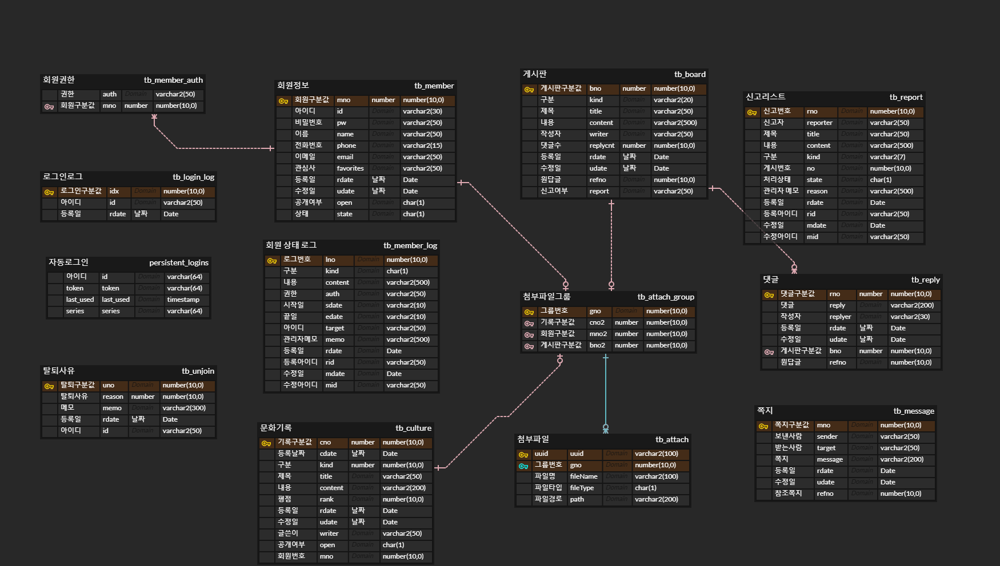
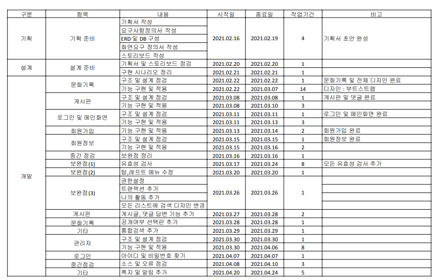

# Culture Diary 
***

## 1. 개요 
### 주제  
영화, 콘서트, 뮤지컬, 연극, 독서 등의 문화생활을 기록하는 데일리형 다이어리입니다. 
자신의 문화생활을 기록하거나 회원들과 후기를 공유할 수 있으며, 다양한 게시판을 통해 자신의 관심사 정보를 얻을 수 있다.          

### 개발배경 및 목적 
개인 프로젝트로 로그인, 게시판 관리 등의 웹사이트를 운영함으로써 Spring 문법과 MVC 패턴의 전반적인 흐름을 이해하는 것이고, 더 나아가 하고싶은 기능, 배우고 싶은 기능을 추가함으로써 지식을 넓히고자 한다. 

### 일정 및 개발환경
* 일정 : 21.2.26 ~ 4.4(개발), 21.4.5~(유지보수) 
* WebServer : 아파치&톰캣(버전9) 
* DB : Oracle 11g 
* Framework/flatform : Spring, bootstrap, jQuery, mybatis
* Programming Language : JAVA, HTML, JavaScript
* 툴 : 이클립스(2020-06) 

## 2. 기능
### 주요 기능
* 회원가입/탈퇴, 로그인/로그아웃, 아이디/비밀번호찾기, 회원정보수정 
* 쪽지 송/수신, 안읽은 쪽지 알림, 통합검색 
* 문화기록 등록/수정/삭제 
* 게시판(자유게시판, 질문&답변, 공유마당) 등록/수정/삭제, 댓글달기
* 관리자 : 공지사항, 회원/게시판관리, 신고처리   

### 2-2. 요구화면 정의서 
[요구화면정의서](./etc/요구화면정의서.pdf)

## 3. DB 구성 
### ERD 구성 

### 테이블 정의서
[테이블정의서](./etc/테이블정의서.pdf)

## 4. 화면정의서 
[화면정의서](./etc/화면정의서.pdf)

## 5. 일정
